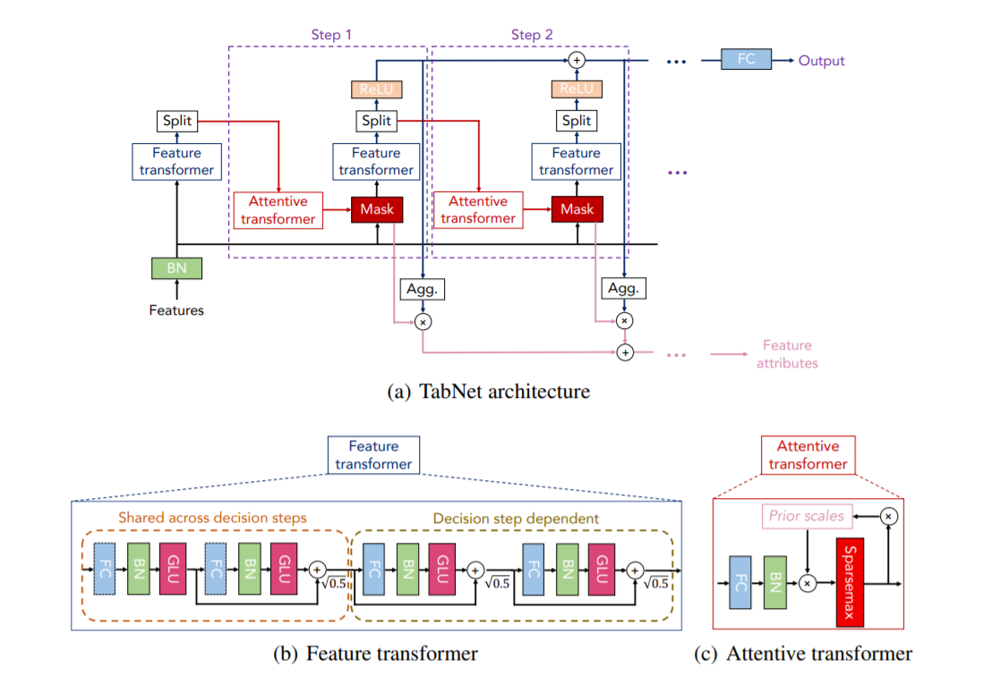

# Data Science Session #1: TabNet


This session shows how to:
- Train TabNet Classifier for a multi-task prediction
- Pre-train TabNet
- Visualize TabNet training metrics
- Interpret TabNet feature importances
- Perform data preparation for TabNet training (categorical feature encoding, filling missing values, etc.)
- Comparison of TabNet results with XGBoost results
- Check the similarity of feature distributions between train and test datasets

#### Pre-requirements
- python 3.8
- pip

#### Requirements
```bash
pip install -r requirements.txt
```
---
**Speaker:** Raid Arfua
